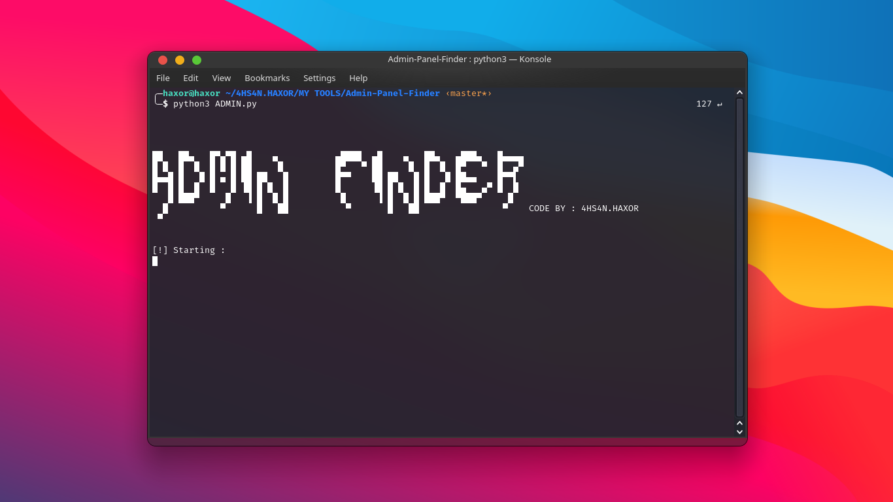
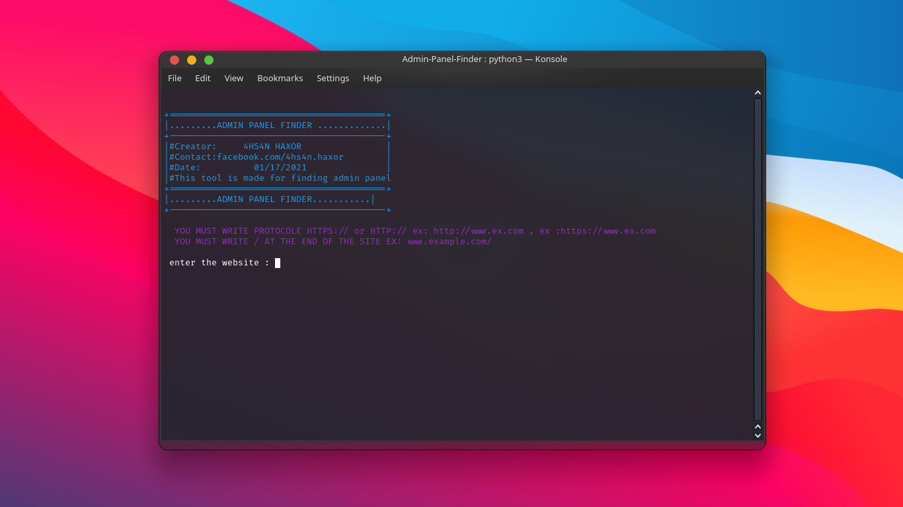

# 4N-ADMIN-FINDER  [](https://www.python.org/downloads/)  

THIS TOOLS MADE FOR FINDING THE WEBSITE ADMIN PANEL - TRY IT FOR SOMTHING NEW .

Made with  by <a href=https://facebook.com/4hs4n.haxor>4HS4N.HAXOR</a>

## Features
- Easyly Find Admin Panel
- Error FIX 
- 900000+ Admin Panel Website

## Usage
Admin Finder  should work on all Linux distros running Python 3
First, clone it by entering the following command in the terminal
``` bash
git clone https://github.com/4hs4n/4N-ADMIN-FINDER.git
```
Now navigate to EmBomber directory
``` bash
cd 4N-ADMIN-FINDER 
```
Now you can run EmBomber
``` bash
python3 finder.py
```

## $

